# **Car Expense Tracker**


An application to track car expenses, designed to simplify the management of multiple vehicles' expenses and categorize them. It also includes advanced features like generating PDF reports and displaying statistics through interactive charts.

&nbsp;&nbsp;&nbsp;&nbsp;


&nbsp;&nbsp;&nbsp;&nbsp;
[](https://github.com/ismaelmarot/car-expense-trcker/blob/HEAD/LICENSE)
&nbsp;&nbsp;&nbsp;&nbsp;

&nbsp;&nbsp;&nbsp;&nbsp;

### Frontend Stack


### Backend Stack


<br/>

----------------------------------------

## **Download**

[](https://github.com/ismaelmarot/car-expense-tracker/releases/download/v2.0.1/CarET-2.0.1-arm64.dmg)

[](https://github.com/ismaelmarot/car-expense-tracker/releases/download/v2.0.1/CarET%20Setup%202.0.1.exe)

<br/>

----------------------------------------

## **Table of Contents**
1. [Features](#features)
2. [Technologies Used](#technologies-used)
3. [Installation](#installation)
4. [Usage](#usage)
5. [Screenshots](#screenshots)
6. [Author](#author)
7. [Screenshots](#screenshots)
8. [License](#license)

<br/>

----------------------------------------

## **Features**
- Record and edit expenses associated with vehicles.
- Support for multiple vehicles.
- Categorize expenses (fuel, maintenance, insurance, etc.).
- Generate PDF and CSV reports with selectable filters.
- Display statistics with interactive charts.
- Track service intervals (km and dates).
- VTV and extinguisher date tracking.
- Spanish and English language support.

<br/>

----------------------------------------

## **Technologies Used**
### **Frontend**
- **React**: Framework for building the user interface.
- **Material UI**: UI component library with modern design.
- **Styled Components**: CSS-in-JS styling for components.

### **Backend**
- **Express**: Minimalist framework for Node.js.

### **Database**
- **SQLite**: Lightweight and efficient local database.

### **Other Tools**
- **Electron**: Desktop application framework.
- **Yarn**: Dependency manager.

<br/>

----------------------------------------

## **Installation**

### **Desktop App (Recommended)**
Simply download the installer for your platform:
- **macOS:** [CarET-2.0.1-arm64.dmg](https://github.com/ismaelmarot/car-expense-tracker/releases/download/v2.0.1/CarET-2.0.1-arm64.dmg)
- **Windows:** [CarET Setup 2.0.1.exe](https://github.com/ismaelmarot/car-expense-tracker/releases/download/v2.0.1/CarET%20Setup%202.0.1.exe)

> **macOS:** If you see _"CarET.app is damaged and can't be opened"_, run this command in Terminal after installing:
> ```bash
> xattr -cr /Applications/CarET.app
> ```

### **Development**
Follow these steps to clone and install the project:

1. **Clone the repository**:
   ```bash
   git clone https://github.com/ismaelmarot/car-expense-tracker.git
   cd car-expense-tracker
   ```

2. **Install dependencies** for the frontend and backend:
   ```bash
   cd car-expense-tracker-frontend
   yarn install
   cd ../car-expense-tracker-backend
   yarn install
   ```

3. **Configure environment variables**:
   - Create a `.env` file in the backend folder with the necessary configurations, for example:
     ```env
     PORT=4000
     DATABASE_URL=car_expenses.sqlite
     ```

<br/>

----------------------------------------

## **Usage**

### **Start the Backend**
1. Navigate to the backend folder:
   ```bash
   cd car-expense-tracker-backend
   ```
2. Start the server:
   ```bash
   yarn start
   ```

### **Start the Frontend**
1. Navigate to the frontend folder:
   ```bash
   cd car-expense-tracker-frontend
   ```
2. Start the application:
   ```bash
   yarn start
   ```

### **Environments**
- For development, use the commands above.
- Configure specific scripts if you need to run the project in production mode.

<br/>

----------------------------------------

## **Screenshots**
*(Here you can include images of your application. If you wish, you can add screenshots of the user interface or views of the charts and reports generated by your app).*

<br/>

-----------------------------------------

<a id="screenshots"></a>
## 📸 [Screenshots](#-table-of-content)

>### 📱 Mobile

<p align="center">
  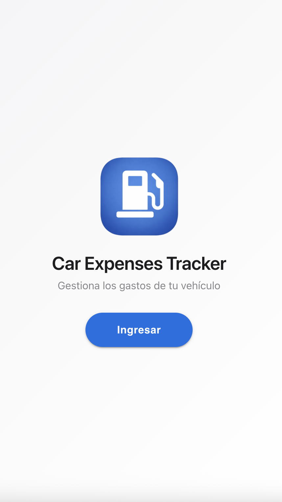
  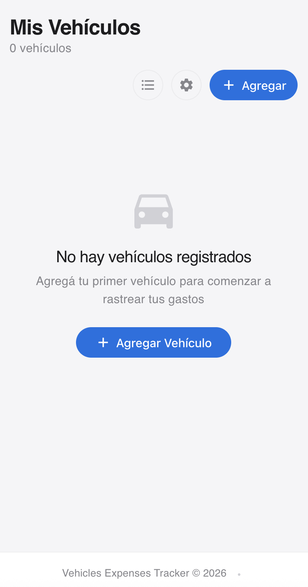
  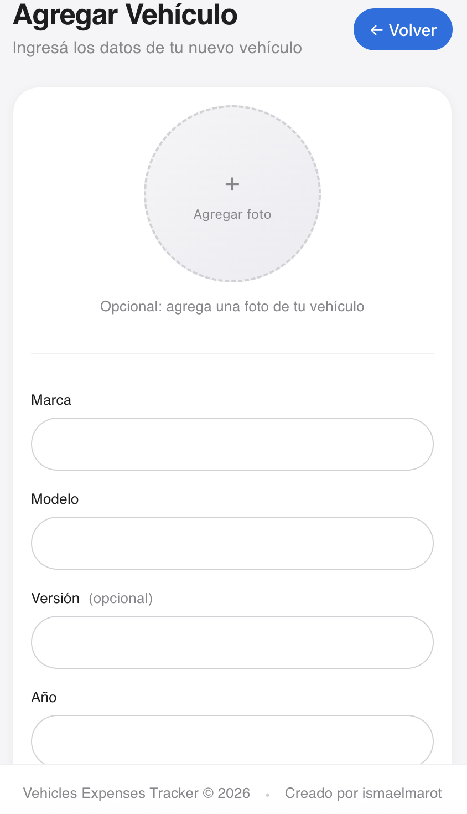
  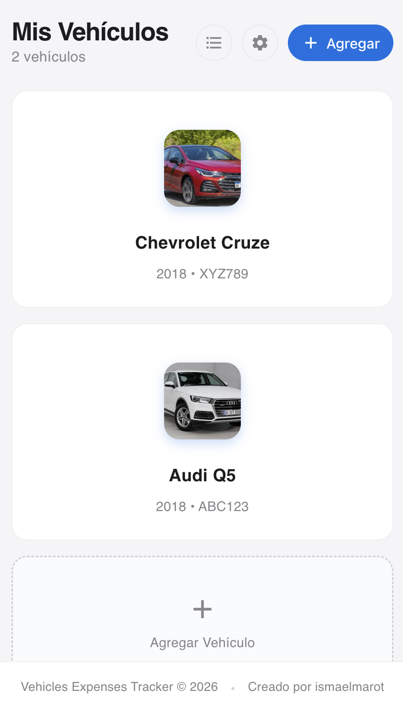
</p>

<details>
   <summary><strong>See more...</strong></summary>
   <br>
   <p align="center">
     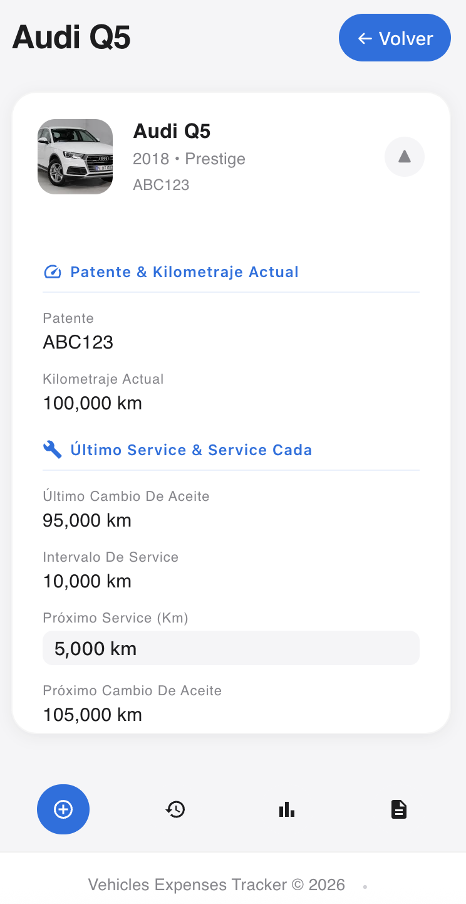
     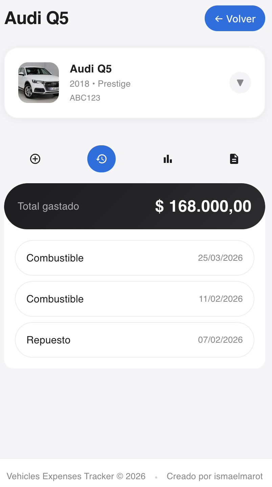
     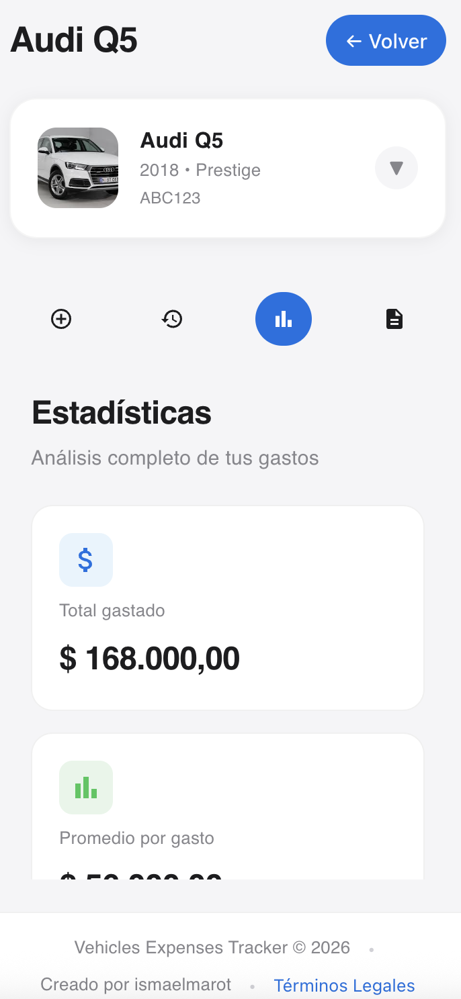
     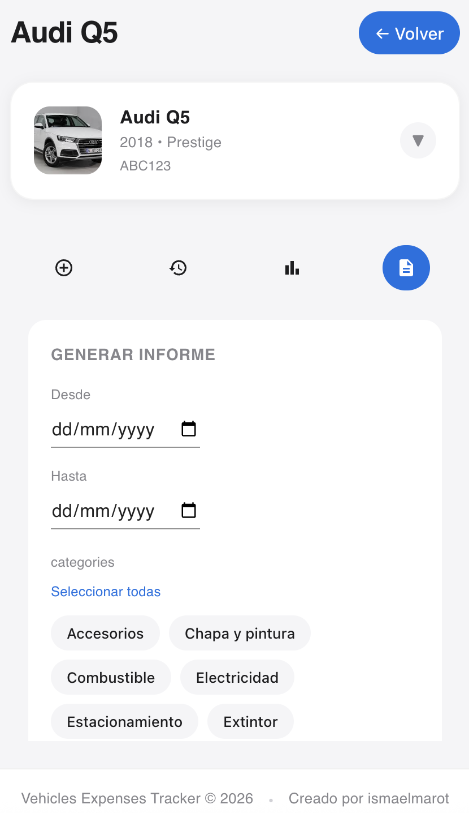
   </p>
</details>

<br>

----------------------------------------

>### 🖥️ Desktop

<p align="center">
  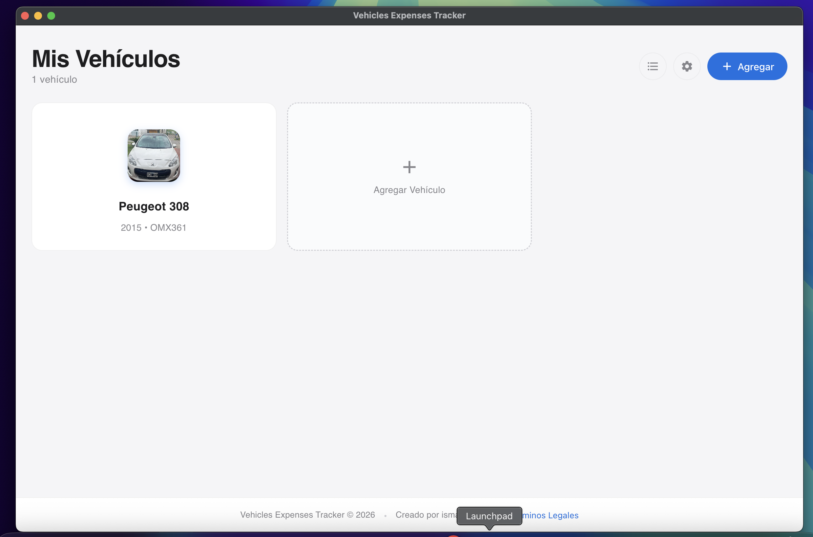
  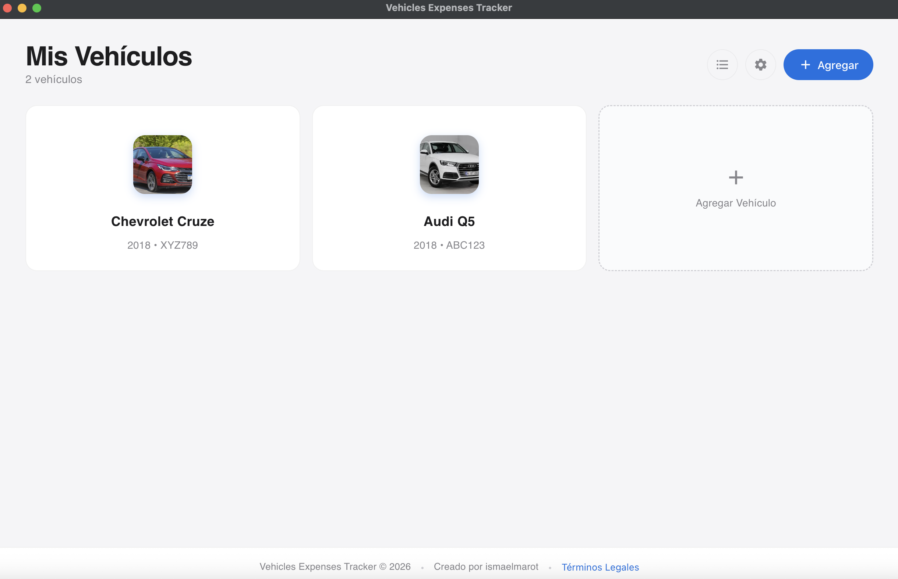
  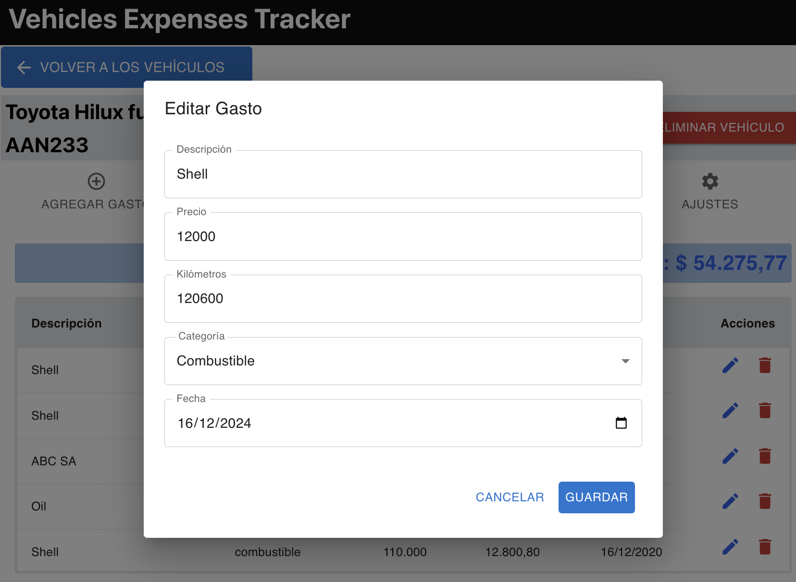
</p>

<details>
   <summary><strong>See more...</strong></summary>
   <br>
   <p align="center">
     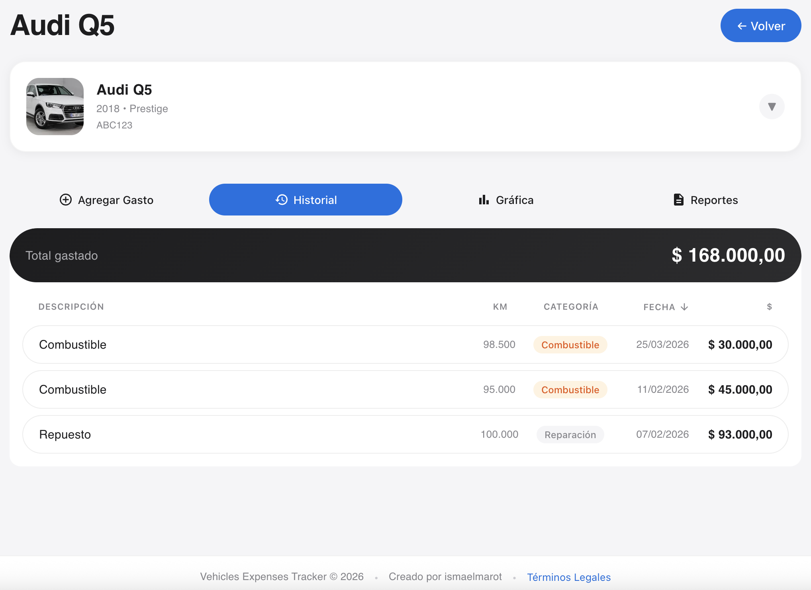
     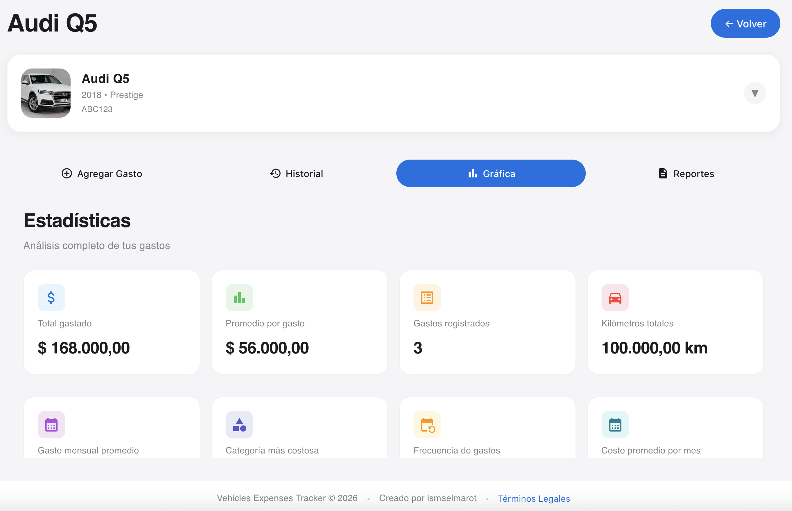
     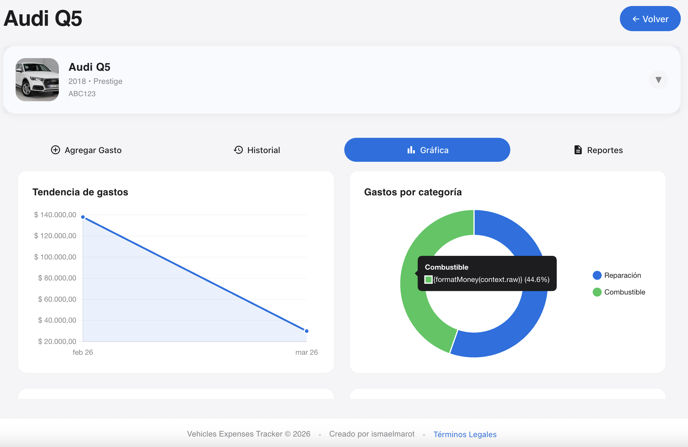
   </p>
   <p align="center">
     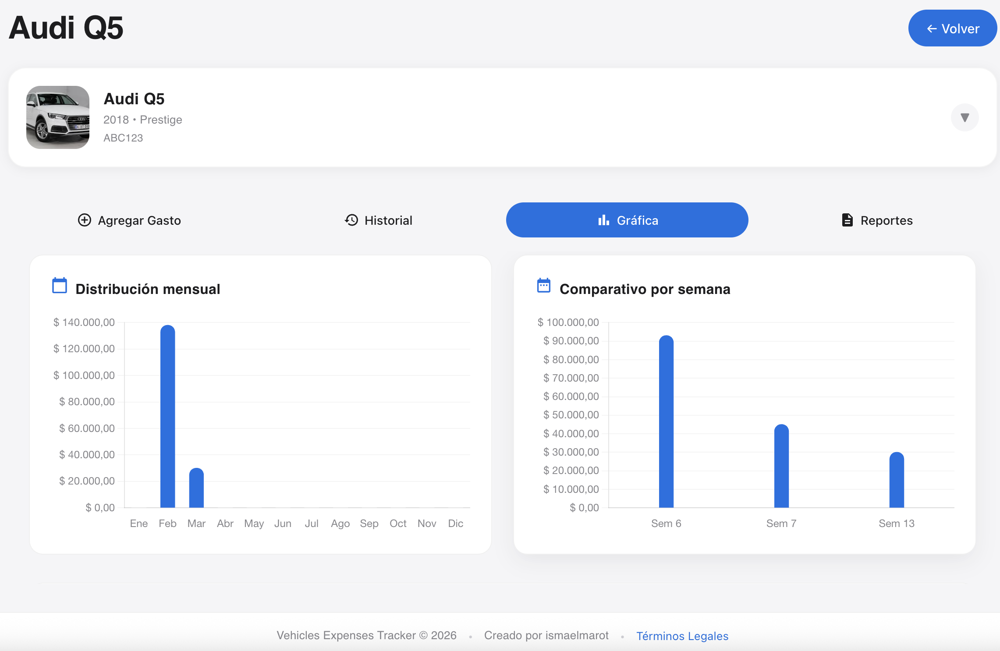
     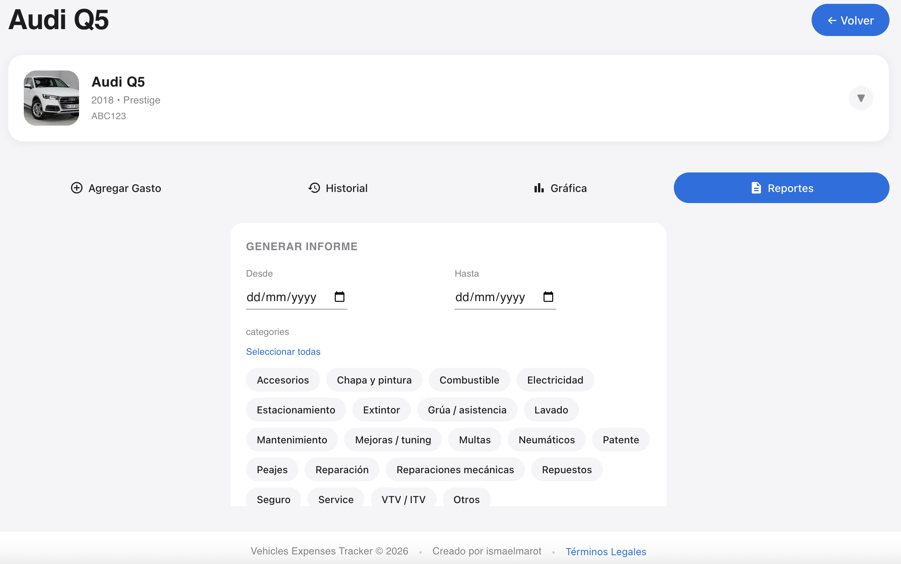
   </p>
</details>

<br>

----------------------------------------

## **License**
This project is licensed under the **MIT License**. See the [LICENSE](LICENSE) file for more details.

<br/>

----------------------------------------

## 📬 [CONTACT](#-table-of-content)

Open to collaboration, feedback, and new opportunities.

[](https://github.com/ismaelmarot)
[](https://linkedin.com/in/ismael-marot)
[](https://ismaelmarot.github.io)


